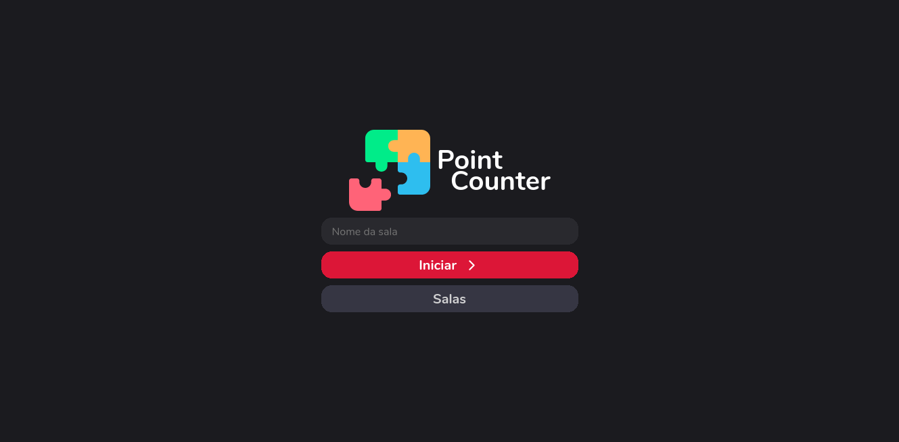
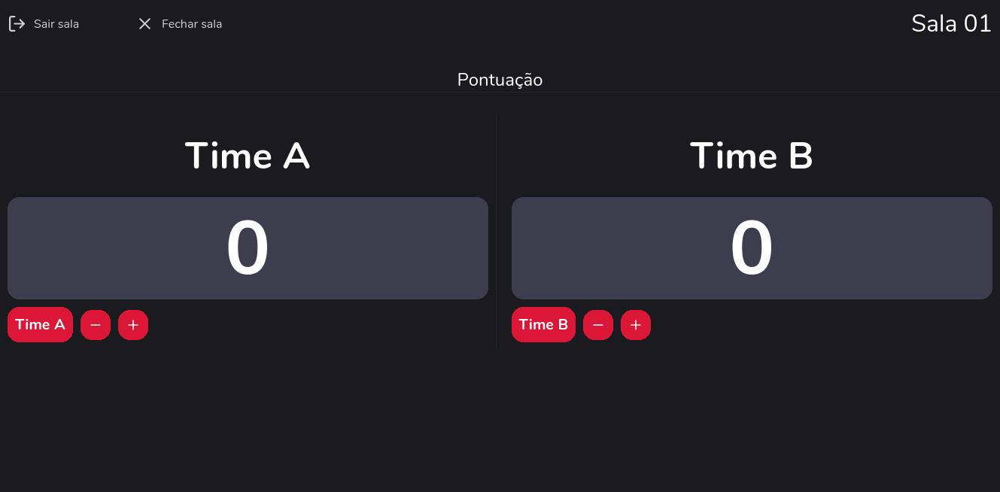
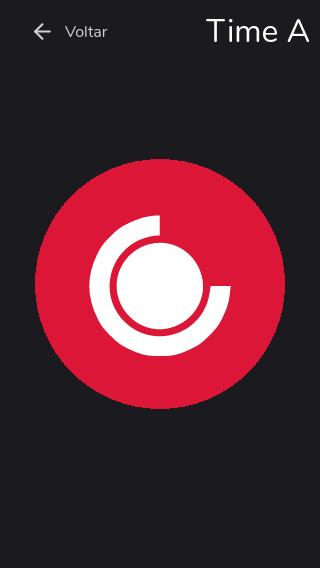

<h1 align="center">
    Point Counter
</h1>

  <a href="#-tecnologias">Tecnologias</a>&nbsp;&nbsp;&nbsp;|&nbsp;&nbsp;&nbsp;
  <a href="#-projeto">Projeto</a>&nbsp;&nbsp;&nbsp;

 

  

## 🚀 Tecnologias

Esse projeto foi desenvolvido com as seguintes tecnologias:

- [React](https://reactjs.org)
- [StyledComponents](https://styled-components.com)
- [Typescript](https://www.typescriptlang.org/)
- [Socket.io](https://socket.io)

## 💻 Projeto

Point Counter é uma aplicação baseada no passa e repassa,
criação de salas com dois times (Time A - Time B), e contagem de pontos.

Link para o [backend](https://github.com/andrejr971/point-counter-back)

  

  

---

Feito by André Junior :wave: [portifólio](https://andrejr.dev)